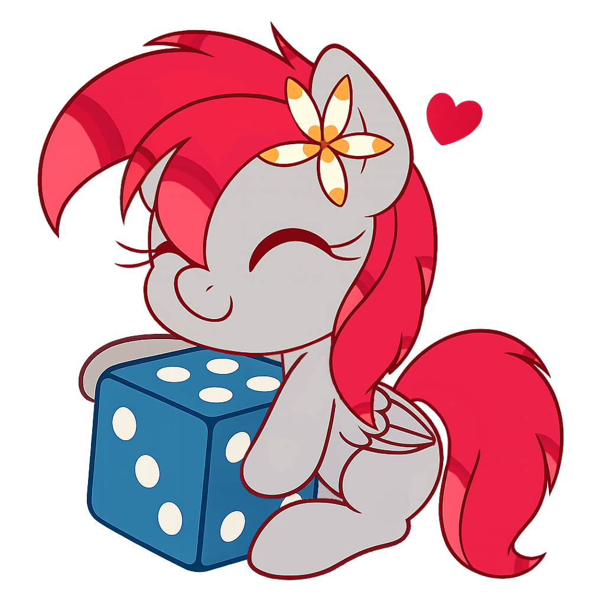

<div align="center">
<p>
    <a href="https://discord.gg/TgHdvJd"></a>
    <a href="https://www.npmjs.com/package/tiny-dices"></a>
    <a href="https://www.npmjs.com/package/tiny-dices"></a>
    <a href="https://www.patreon.com/JasminDreasond"></a>
    <a href="https://ko-fi.com/jasmindreasond"></a>
</p>
<p>
    <a href="https://nodei.co/npm/tiny-dices/"></a>
</p>
</div>

# 🎲 Tiny Dices - Fun 3D Dice Rolling with JavaScript

Welcome to **Tiny Dices**! This JavaScript library is here to bring an extra layer of fun and magic to your dice-rolling experience. ✨ Whether you're rolling for your favorite tabletop RPG or just need some virtual dice to shake things up, TinyDices makes it all possible with style!

### Inspiration ✨

This project was initially a custom dice application from Pony Driland repository. The tiny dice eventually evolved during the development that resulted in this project that is now published by the same creator of the Pony Driland repository.

### Features 🌟

- **Roll any number of dice** – from a single die to a whole set of them! 🎲
- **Customizable max values** – set different max values for each die. 🌈
- **Spinning animation** – your dice can spin infinitely or stop after a cool animation. 🔄
- **Dynamic cube generation** – each die is a rotating, animated cube with unique faces. 🎭
- **Zero-inclusive rolls** – make 0 a valid result if you need it! (Optional) 🥳

### How to Use 🌟

1. **Create a Dice Instance:**

   ```js
   const container = document.getElementById('myDice');
   const dice = new TinyDices(container);
   ```

2. **Roll Some Dice:**

  - 🎲 Roll 3 six-sided dice:

    ```js
    dice.roll('7,7,7'); // Rolls 3d7 🎲🎲🎲
    ```

  - 🎯 Roll a mix of dice:

    ```js
    dice.roll('6,12,20'); // Rolls d6, d12, and d20 🔢🎲
    ```

  - 🔄 Roll with infinite spinning animation:

    ```js
    dice.roll([10, 10], false, true); // Rolls 2d10 with infinite spin 🔄🎲
    ```

  - 🧮 Roll with values starting from 0:

    ```js
    dice.roll([10, 10], true); // Rolls 2d10 starting from 0 🥳🎲
    ```

  - 🧪 Roll a custom set of dice with zero and infinity:

    ```js
    dice.roll([4, 8, 6], true, true); // Rolls d4, d8, and d6 from 0 with infinite spin ⚙️🎲
    ```

### Customization 🎨

Feel free to customize the appearance of your dice with different skins:

- **Background Skin:** Set a cool background with solid colors like `'gray'`, `'blue'`, or `'green'`, or something magical! ✨
  ```js
  dice.setBgSkin('gray'); // Sets background skin to gray 🌫️
  ```

- **Text Skin:** Make your dice text stand out with solid color skins like `'red'`, `'yellow'`, or `'white'`! 🌟
  ```js
  dice.setTextSkin('red'); // Makes the text red 🔴
  ```

- **Border Skin:** Add a border effect to your dice with colors like `'black'`, `'orange'`, or `'purple'`! ✨
  ```js
  dice.setBorderSkin('2px solid black'); // Sets a black border ⚫
  ```

- **Get Current Skins:** Check what skins you're using right now:
  ```js
  dice.getBgSkin(); // Returns current background skin 🎨
  dice.getTextSkin(); // Returns current text skin 🖋️
  dice.getBorderSkin(); // Returns current border skin ⚡
  ```

---

### 💻 How It Works

Tiny Dices works by creating a customizable, **3D cube** with **6 animated faces**. Every time you roll, the faces spin and reveal random numbers. 🎲✨

- **The front face** shows the result of your roll 🥳
- **The other faces** are randomized, creating a truly unique dice experience!

You can also customize the cube's animation. Want it to spin forever? Or just do a quick 360? 🎡

---

### 🎨 Styles & Animations

Tiny Dices comes with cool animation effects and customizable styles. From **spin effects** to **face transformations**, the dice will roll in style. ✨

- **Spin it Infinite!**: Watch the dice spin forever for an endless feeling of anticipation! 🔄
- **Spin it Custom**: You can control how the dice rotate with custom animations. Rotate along different axes for the coolest effects! 🔮

---

### 🚨 Don't Forget

Remember to check out the **[Tiny Dices Docs](./docs/README.md)** for more detailed instructions and advanced features! 📝

---

### 📣 Credits

This project was created by **Yasmin Seidel (JasminDreasond)** with some **extra help** from **ChatGPT**. Tiny thanks to everyone contributing to the open-source community! 💖

---

### License 📜

This project is licensed under the GPL-3.0 License – feel free to use and customize it for your own projects! 🛠️

---

### 🚀 Let's roll those tiny dice! 🎲

---

## 🔙 Back to Tiny Essentials

Did you like this module? It’s part of the **Tiny Essentials** collection — a set of minimal yet powerful tools to make development easier.
👉 [Click here to explore more Tiny Essentials modules](https://github.com/JasminDreasond/Tiny-Essentials)

---

<div align="center">
<a href="./img/icons/"></a>
<br/>
Made with tiny love!
</div>