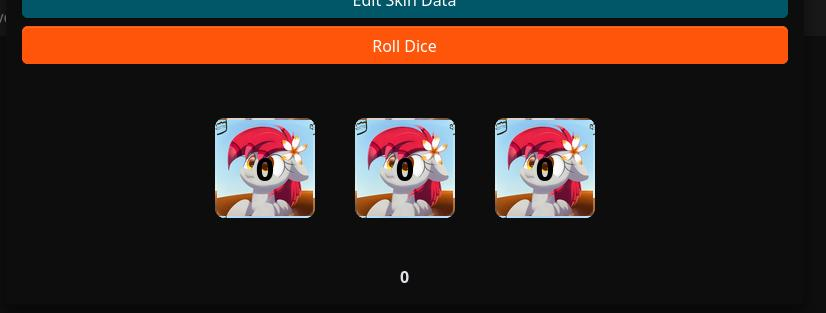
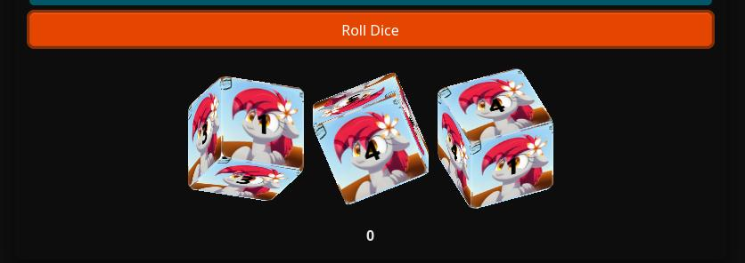

# 🎲 Tiny Dices API Documentation

**Tiny Dices** is a lightweight and fully customizable dice roller built for the web.  
It brings fun, magic, and a touch of flair to any dice-based experience—whether you're building a tabletop RPG interface, adding flair to a browser game, or just rolling dice for the joy of it! ✨

## 📚 Documentation Menu

### 🎲 Dice Behavior
- [roll.md](./roll.md) – Dice rolling logic, options, and return data

### 🛠 Customization
- [custom.md](./custom.md) – Customizing dice appearance and behavior

### 👩‍💻 Developer Reference
- [dev.md](./dev.md) – Internal structure, private methods, and advanced usage

---

### 🧩 What makes Tiny Dices special?

- 🔧 **Customizable** – Every visual aspect of the dice can be themed using CSS or controlled via JavaScript.
- 🎨 **Animated** – Dice come to life with smooth, animated rolls and optional infinite spin.
- 🧠 **Smart API** – Designed for flexibility: roll a single die or create complex multi-die configurations easily.
- ⚡ **Lightweight** – No dependencies, pure JavaScript. Perfect for embedding into any project.

---

## 🚀 Quick Start

You can use Tiny Dices in the browser or with Node.js. Choose your favorite style!

---

### 🌐 Browser Version

Include the script in your HTML and start rolling:

```html
<!-- Include Tiny Dices stylesheet -->
<link rel="stylesheet" href="/node_modules/tiny-dices/dist/TinyDices.min.css">

<!-- Include Tiny Dices script -->
<script src="/node_modules/tiny-dices/dist/TinyDices.min.js"></script>

<!-- Create a div element to hold the dice -->
<div id="dice-area"></div>

<script>
  // Set the container element where the dice will appear
  const dice = new TinyDices(document.getElementById('dice-area'));

  // Roll two six-sided dice
  dice.roll('6,6');

  // Set a skin for the dice background
  dice.setBgSkin('black');
</script>
```

> Make sure `TinyDices.min.js` is accessible from your project path.

---

### 📦 Node.js / Bundler (ESM)

Install via npm:

```bash
npm install tiny-dices
```

Then use it in your JavaScript:

```js
import TinyDices from 'tiny-dices';

const dice = new TinyDices();

// Roll a mix of dice: d4, d8, d20
dice.roll([4, 8, 20]);
```

> This version assumes you're using a bundler like Vite, Webpack, or directly with Node.js ESM.

---

### 🧱 Constructor

```js
const dice = new TinyDices(containerElement);
```

| Param            | Type      | Description                          |
|------------------|-----------|--------------------------------------|
| `containerElement` | `HTMLElement` | DOM element where dice will be rendered. Required. |

---

### 🎲 `roll(perDieInput, canZero = false, rollInfinity = false)`

Rolls one or more dice using custom face values.

```js
dice.roll('6,8,10');         // Rolls d6, d8 and d10
dice.roll([4, 12], true);    // Rolls d4 and d12, allowing 0
```

| Param          | Type                 | Description |
|----------------|----------------------|-------------|
| `perDieInput`  | `string` or `number[]` | Comma-separated string or array of die max values. |
| `canZero`      | `boolean`            | Allow 0 as minimum roll value (default: `false`). |
| `rollInfinity` | `boolean`            | Enable infinite spinning animation (default: `false`). |

Returns: `Array<{ result: number, sequence: number[] }>` — Result per die.

---

### ♻️ `destroy()`

Destroys all internal HTML and resets the dice system.

```js
dice.destroy();
```

This method:
- Clears all rendered dice
- Resets all skins and configuration
- Marks the instance as destroyed

---

### ❌ `isDestroyed()`

Checks if the instance has been destroyed.

```js
if (dice.isDestroyed()) {
  console.warn('This instance has been destroyed!');
}
```

Returns: `boolean`

---

### 💡 `existsHtml()`

Checks if the internal HTML structure still exists in the DOM.

```js
if (!dice.existsHtml()) {
  console.warn('The dice container is missing!');
}
```

Returns: `boolean`

---

### 📷 With Default Dice Appearance


### 🎨 Custom Dice Example 1



